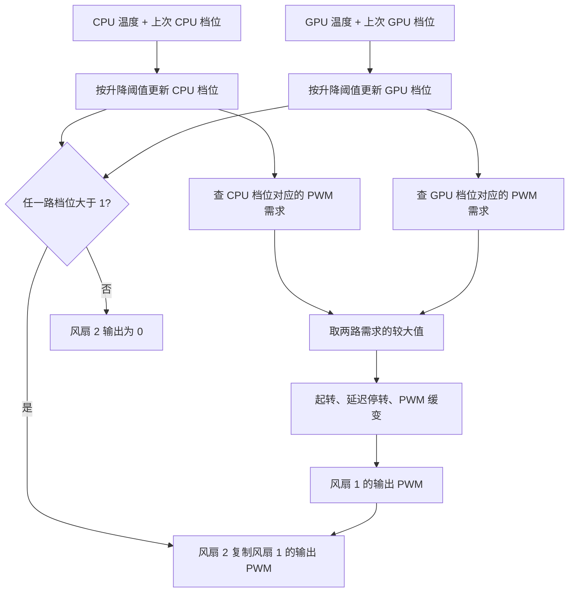

# 默认风扇控制策略：TUXEDO 驱动加载后如何调速

分析日期：2026-09-29。适用设备为 GM6AQ7C、BIOS `N.1.04MRO11`，驱动版本为本仓库固定的 TUXEDO Drivers `4.22.3`。

**驱动加载后的默认策略是：原厂 EC 根据 CPU、GPU 温度分别维护一个需求档位，取两路较大的 PWM 需求，经过起转、延迟停转和缓变处理后输出给第一风扇；第二风扇在低档关闭，其余正常档位复制第一风扇的 PWM。**

温度阈值和这套执行逻辑来自原厂 EC 固件。TUXEDO 驱动加载时选择了对应的 OEM 模式；这些曲线数值不是 TUXEDO 驱动定义的。

证据来自本机保存的 EC 固件静态解析、当前模式与型号字段核对，以及 30 个连续只读样本。实机样本覆盖的是低温档位，没有进行全温区加压测试。

## 1. 本文所说的“默认”是什么状态

这里指驱动加载后选择的 `0x0751 = 0x00` 档，本项目命名为 `enthusiast`。同时满足以下条件：

| 条件 | 本次读数 | 含义 |
| --- | --- | --- |
| OEM 模式 `0x0751` | `0x00` | 默认性能档，全速位关闭 |
| 共享控制字段 `0x0741` | `0x81` | bit0 开启 |
| 分离自定义风扇表字段 `0x07c5` | `0x08` | bit7 关闭 |
| 自定义风扇表字段 `0x07c6` | `0x00` | bit2 关闭 |
| 模式修饰字段 `0x07a4` | `0x00` | bit7 关闭，未选择相应替代表 |

驱动初始化将 `0x0751` 写为 `0x00`，并开启 `0x0741 bit0`。在这个型号上，初始化不会执行旧型号的五字节默认风扇曲线复制分支。

因此，这是一条**驱动加载后所选档位的原厂曲线**。如果加载前使用的是另一个 OEM 档位，加载前后风扇表现可以不同，不能直接认定它们使用同一条曲线。

驱动定义见 [nix/tuxedo-drivers/package.nix](nix/tuxedo-drivers/package.nix)，初始化实现见 [上游 uniwill_keyboard.h](https://gitlab.com/tuxedocomputers/development/packages/tuxedo-drivers/-/blob/v4.22.3/src/uniwill_keyboard.h) 的 `uniwill_keyboard_probe()`。

## 2. 先区分四个概念

| 概念 | 具体含义 |
| --- | --- |
| CPU/GPU 温度 | EC 的两个温度输入，字段分别为 `0x043e`、`0x044f` |
| CPU/GPU 需求档位 | 根据温度和历史状态维护的两个索引，分别在 `0x0460`、`0x0468` |
| 目标 PWM | 按档位查到的需求值，再经过两路需求合并 |
| 输出 PWM / 实际 RPM | PWM 是给风扇的控制量；RPM 是风扇实际转速，单独读取 |

**CPU、GPU 两列描述的是温度需求。最终风扇输出还要经过需求合并和分配，不能把两列直接理解为“两只风扇各按一列独立运行”。**

这里 PWM 原始值的满刻度为 200：50 对应 25%，60 对应 30%，180 对应 90%。PWM 百分比不能直接换算成“最高 RPM 的百分之几”。两只风扇即使使用相同 PWM，实际 RPM 也可以不同。

本文的风扇 1、风扇 2 按 EC 遥测字段编号，没有核实它们与物理左、右位置的对应关系。

## 3. 一次控制更新的完整顺序



这张图描述已解析的普通自动控制路径。全速模式和其他特殊固件分支见后面的适用范围说明。

### 3.1 两路分别维护档位，带滞回

CPU、GPU 各保留自己的上次档位。每次进入对应查表逻辑，按以下顺序处理：

```text
如果 当前温度 > 当前档位的升档阈值：
    档位加 1
否则，如果 当前温度 < 当前档位的降档阈值：
    档位减 1
否则：
    保持档位

需求 PWM = 此次档位对应的表项
```

每次调用这段逻辑最多升降一档。温度突然跳高时，需要经过多次更新逐步到达对应档位。

升档比较是严格 `>`，降档比较是严格 `<`。例如升档阈值是 66°C，整数温度读到 67°C 才升档；降档阈值是 65°C，则读到 64°C 才降档。

这也是为什么相同温度不一定对应相同目标 PWM：降温过程中可能仍保留先前的较高档位。

### 3.2 合并的是 PWM 需求，而不是两路温度

```text
共同目标 PWM = max(CPU 需求 PWM, GPU 需求 PWM)
```

CPU、GPU 的温度表不同，应当先各自查表，再比较得到的 PWM。不能先取两种温度的最大值，再套用一张表。

例如 CPU 需求为 45%、GPU 需求为 30%，共同目标为 45%。GPU 需求升到 55% 后，共同目标随之变成 55%，即使 CPU 温度没有变化。

### 3.3 第一风扇不会总是立即跳到查表目标

查表目标之后还有输出处理：

- **起转**：当第一风扇输出为 0、需求变为非零时，固件设置起转计数。在该计数期间，第一路输出使用原始值 50，即 25% PWM，再继续追踪目标。
- **延迟停转**：非零需求会刷新续转计数。需求降为 0 后，如果续转计数仍非零，固件会暂时保留 25% 需求；计数归零后才允许停转处理。
- **缓变**：正常追踪目标时，按内部计数节拍将 PWM 原始值加 1 或减 1，即每次改变 **0.5 个百分点**。
- **相同目标**：已经达到目标时，不继续增减输出。

本次解析到的起转计数初值为 20，续转计数初值为 180。当前配置下普通缓变节拍使用计数器对 3 取余的条件。本轮没有完成相关调度周期、续转计数递减周期的核对，**不把这些计数直接写成秒或毫秒**。

因此，下面的温度表表示查表需求。实际输出还可能处于起转、续转或追踪目标的过程中。

### 3.4 第二风扇什么时候相同，什么时候不同

本机默认路径的分配规则为：

```text
如果 CPU 档位 > 1 或 GPU 档位 > 1：
    风扇 2 PWM = 风扇 1 当前输出 PWM
否则：
    风扇 2 PWM = 0
```

这里复制的是第一路**经过输出处理后的 PWM**，不是未经缓变的查表需求。

| 场景 | 第一风扇 | 第二风扇 |
| --- | --- | --- |
| CPU 档位 1，GPU 档位 0 或 1 | 目标 25% | 停转 |
| CPU 或 GPU 达到档位 2 及以上 | 追踪两路较大的需求 | 复制第一风扇当前 PWM |
| 两路需求都降为 0 | 仍要经过续转/停转处理 | 低档条件下保持停转 |

**这条默认策略不会把正常运行中的两只风扇长期分别设成例如 45% 和 30%。** 硬件及 TUXEDO 驱动具备分别设置的能力，但需要进入对应的独立控制路径。当前默认模式没有启用那套分离自定义表。

## 4. 默认温度表

### 4.1 从低温开始升温时的需求

下面按温度单调上升、相应档位更新已经完成的情况列出。降温时应使用下一节的滞回表。

| PWM 需求 | CPU 升温到 | GPU 升温到 |
| --- | --- | --- |
| 0% | ≤54°C | ≤56°C |
| 25% | 55°C | 无此档 |
| 30% | 60°C | 57°C |
| 35% | 64°C | 59°C |
| 45% | 67°C | 62°C |
| 55% | 70°C | 65°C |
| 60% | 73°C | 68°C |
| 70% | 76°C | 71°C |
| 80% | 79°C | 74°C |
| 90% | 82°C | 76°C |

GPU 的内部档位 0、1 都请求 0%。升温到 57°C 后，需要依次经过这两个档位的比较，才能进入请求 30% 的档位 2。

### 4.2 CPU 档位、升档与降档阈值

“当前档位”是这一行的状态；升档条件满足时进入下一行，降档条件满足时退回上一行。

| 当前档位 | 当前需求 PWM | 升到下一档 | 降到上一档 |
| --- | --- | --- | --- |
| 0 | 0% | >54°C | 无更低档 |
| 1 | 25% | >59°C | <48°C |
| 2 | 30% | >63°C | <50°C |
| 3 | 35% | >66°C | <62°C |
| 4 | 45% | >69°C | <65°C |
| 5 | 55% | >72°C | <68°C |
| 6 | 60% | >75°C | <71°C |
| 7 | 70% | >78°C | <74°C |
| 8 | 80% | >81°C | <77°C |
| 9 | 90% | 阈值 255，正常温区不再升档 | <80°C |

### 4.3 GPU 档位、升档与降档阈值

| 当前档位 | 当前需求 PWM | 升到下一档 | 降到上一档 |
| --- | --- | --- | --- |
| 0 | 0% | >56°C | 无更低档 |
| 1 | 0% | >56°C | <48°C |
| 2 | 30% | >58°C | <48°C |
| 3 | 35% | >61°C | <57°C |
| 4 | 45% | >64°C | <60°C |
| 5 | 55% | >67°C | <63°C |
| 6 | 60% | >70°C | <66°C |
| 7 | 70% | >73°C | <69°C |
| 8 | 80% | >75°C | <72°C |
| 9 | 90% | 阈值 255，正常温区不再升档 | <74°C |

两张表各有 16 项；后续占位档位的 PWM 都维持 90%。完整字节值见第 8 节。

## 5. 几个具体运行场景

以下讨论普通路径，假设没有全速或特殊覆盖。涉及“最终 PWM”时，指起转和缓变处理完成之后。

### 5.1 CPU 热、GPU 较凉

CPU 从低温升到 67°C 并到达档位 4，请求 45%；GPU 位于档位 2，请求 30%。

共同需求为 45%。第一风扇逐步追到 45%，第二风扇复制第一路输出，最终也是 45%。GPU 温度较低不会让第二风扇单独保持在 30%。

### 5.2 只有低档需求

CPU 从低温升到 55°C，进入档位 1，请求 25%；GPU 尚在档位 0，请求 0%。

共同需求为 25%。两路内部档位都没有超过 1，第一风扇运行、第二风扇停转。

### 5.3 GPU 主导调速

CPU 位于档位 2，请求 30%；GPU 升到档位 5，请求 55%。

共同需求为 55%，两只风扇最终都使用 55% PWM。

### 5.4 相同温度，不同历史，结果不同

假设 GPU 需求为 0：

- CPU 从低温升到 58°C，停留在档位 1：请求 25%，第二风扇停转。
- CPU 曾达到档位 2，随后降到 58°C：尚未低于该档的 50°C 降档阈值，因此仍请求 30%，第二风扇也运行。

所以，仅凭一个当前温度值无法完整判断风扇输出，还需要知道两路历史档位和输出处理阶段。

## 6. 当前实机核对到了什么

采样时三个 TUXEDO 模块均已加载，OEM 模式、自定义表开关和型号字段在 30 个样本中保持一致。

| 字段 | 观测结果 |
| --- | --- |
| CPU 内部档位 `0x0460` | 2 |
| CPU 需求 `0x0461` | 原始值 60，即 30% |
| GPU 内部档位 `0x0468` | 2 |
| GPU 需求 `0x0469` | 原始值 60，即 30% |
| 两路需求合并值 `0x0670` | 原始值 60 |
| 两路输出 `0x075b`、`0x075c` | 均为原始值 60 |
| 风扇 RPM | 第一只约 2150，第二只约 2080 |

30 个样本中，读取前后档位一致，两个需求寄存器均匹配固件表的对应项。这验证了当前低温工作点，不能据此声称所有高温档、起转和停转时序都已完成物理测试。

## 7. 为什么认定本机选择了这一对曲线

以下是固件控制流与可读运行字段的交叉推导：

1. 当前 `0x074c=0xd8`，`&0x3f=0x18`。固件文件偏移 `0x18746` 的型号分派选择 `0x18781`。
2. 该分支根据内部 `0x08b8` 是否等于 `0x21`，在表组 `0x5d55` 与 `0x5d3d` 间选择。
3. 当前 `0x049f=0x0a`，`&0x78=0x08`。配置解码 `0x19535` 走 `0x19589`，在 `0x195a2` 将内部 `0x08b8` 设为 `0x23`。可读派生字段 `0x0448=0xc3` 也吻合 `0x1bb79` 中针对 `0x23` 的分支。因此选中 `0x5d3d`。
4. 当前 `0x0751=0x00`、`0x07a4 bit7=0`，模式选择走表组偏移 0。
5. 表组 `0x5d3d` 的前四字节为 `50 65 59 05`，分别指向 CPU 表 `0x5065`、GPU 表 `0x5905`。
6. `0x0741 bit0=1`，但 `0x07c6 bit2=0`，因此进入 `0x18dc2` 的内置表路径，而非自定义表路径。

内部 `0x08xx`、`0x0axx` 指针经当前主机 MMIO 窗口读取返回 `0xff`。本文没有把这些值当成有效活动表指针；选择结论来自上述分支和可读状态的推导。

## 8. 可复核的固件证据

### 8.1 二进制身份

- 原厂包：`N.1.04MRO11_EC_1.19.zip`。
- 提取文件：`embedded-ec-candidate.bin`，大小 262144 字节。
- SHA-256：`bb225131a860ec6b46416a2829fa65d5d6a4600a1946d8a00fbeb61022d7dbe5`。
- 与本机此前只读保存的 32 MiB SPI 映像中，偏移 `0x151d1bc` 开始的连续 262144 字节逐字节一致。

这证明分析使用的是本机已保存固件中的同一份 EC 映像。本轮没有重新读取整个运行 EC Flash。

### 8.2 默认表的原始数据

每张表依次存放 16 字节升档阈值、16 字节降档阈值、16 字节 PWM 原始值。下面用十进制保留全部数据，可直接按文件偏移复核。

```text
CPU 表：文件偏移 0x5065
升档：54 59 63 66 69 72 75 78 81 255 255 255 255 255 255 255
降档： 0 48 50 62 65 68 71 74 77  80 255 255 255 255 255 255
PWM ： 0 50 60 70 90 110 120 140 160 180 180 180 180 180 180 180

GPU 表：文件偏移 0x5905
升档：56 56 58 61 64 67 70 73 75 255 255 255 255 255 255 255
降档： 0 48 48 57 60 63 66 69 72  74 255 255 255 255 255 255
PWM ： 0  0 60 70 90 110 120 140 160 180 180 180 180 180 180 180
```

### 8.3 关键逻辑位置

以下均是 EC 二进制的文件偏移，不是 Linux 虚拟地址，也不是 `uniwill_keyboard.h` 的行号。

| 文件偏移 | 实现内容 |
| --- | --- |
| `0x18746` | 按型号配置选择曲线表组 |
| `0x18781` | 本机选择 `0x5d3d` 或 `0x5d55` 的分支 |
| `0x19535` | 解码配置并设置内部 `0x08b8` |
| `0x18c81` | 根据 OEM 模式选择表组内的曲线对 |
| `0x18d12` | 自定义表使能判断 |
| `0x18dc2` | CPU 内置曲线查询及滞回 |
| `0x18e2f` | GPU 内置曲线查询及滞回 |
| `0x18ebf` | 两路 PWM 需求取最大值 |
| `0x18e91` | 缓变节拍参数 |
| `0x19069` | 第一风扇起转处理 |
| `0x1908c` | 零需求时的续转/停转处理 |
| `0x190b6` | 第一风扇输出向目标增减 |
| `0x19146` | 本机第二风扇停转或复制第一路的选择 |
| `0x19153` | 读取第一路 PWM 输出 |
| `0x19159` | 将第二路待写值置零 |
| `0x1915a` | 写第二路 PWM 输出 |
| `0x1dbf8`、`0x1dc00` | 把输出复制到主机可读 PWM 字段 |

第二风扇分配的关键指令如下，保留文件偏移以便复核：

```text
0x19146  lcall 0xda50       ; 判断 CPU 档位是否超过 1
0x19149  jnc   0x9153       ; 超过则复制第一路
0x1914b  mov   dptr, #0x0468
0x1914e  lcall 0xda54       ; 判断 GPU 档位是否超过 1
0x19151  jc    0x9159       ; 两路都未超过则关闭第二路
0x19153  mov   dptr, #0x1809
0x19156  movx  a, @dptr     ; 取第一路当前输出
0x19157  sjmp  0x915a
0x19159  clr   a            ; 第二路输出为 0
0x1915a  mov   dptr, #0x1804
0x1915d  movx  @dptr, a     ; 写第二路
```

EC 使用 8051 分银行代码。高段指令的文件偏移为 `0x18xxx` / `0x19xxx` 时，其编码中的代码地址为 `0x8xxx` / `0x9xxx`；不能把所有 16 位跳转地址直接当作同数值的文件偏移。完整线性反汇编中的数据区也可能显示成伪指令，应沿已确认的调用和分支边界阅读。

## 9. 默认策略、驱动能力与本仓库接口的关系

| 层次 | 负责什么 |
| --- | --- |
| 原厂 EC 固件 | 保存曲线、维护档位和滞回、合并需求、执行起转/停转/缓变、分配两路 PWM |
| TUXEDO 驱动 | 初始化 OEM 模式和控制状态，提供自动、全速、两路指定速度等接口 |
| 本仓库 [src/tuxedo/fan.rs](src/tuxedo/fan.rs) | 提供模式/转速查询、`auto`、`full` 和自定义曲线策略的查询/应用；持续调速仍由 EC 执行 |

驱动的独立指定速度路径会启用分离自定义表，可以给两路不同的 PWM。它与本文分析的默认自动路径不同，不能用它的 `0–115°C` / `0–120°C` 手动控制表解释当前默认曲线。

## 10. 适用范围与尚未实测的部分

- 表中 90% 是当前默认普通曲线的最高需求，不是硬件最大值，也不是全速或所有保护路径的上限。
- 全速模式、外部指定速度、停机及特殊固件条件可绕过或修正普通自动路径；本文的简化流程不覆盖这些分支的全部语义。
- `powersave`、`overboost` 使用其他表组项；本文只给出默认 `0x00` 档的完整数据。
- 起转、续转及缓变的计数逻辑已定位，具体墙钟时间尚未核实。
- 本次没有给出未经实测的各档 RPM，也没有通过加热覆盖所有升降档与启停条件。
- 本机型号和固件匹配是结论的适用条件；不能仅凭同属 Uniwill/Tongfang 平台就把表推广到其他机器。


## 11. 使用 x-laptune 应用独立策略

内置策略 `baseline` 完整复制本文默认档的 CPU/GPU 两张表，定义在 [baseline.json](src/tuxedo/fan/policies/baseline.json)。它也作为系统配置的初始内容。

| 策略 | 数据来源 |
| --- | --- |
| `baseline` | 当前程序内置的基准表 |
| `custom` | 每次调用时重新读取 `--config FILE` 指定的文件；默认 `/etc/x-laptune/fan-policy.json` |

启用 `programs.x-laptune.enable` 后，NixOS 通过 tmpfiles 在该文件不存在时复制初始配置。它是 `root:root 0644` 的普通文件，可以使用 `sudoedit` 编辑；后续开机、系统切换和包升级不会用初始内容覆盖已有文件。

初始模板也随 Nix 包安装到 `share/x-laptune/fan-policy.json`。未通过 NixOS 模块安装时，可以先使用下面的 `--reset-config` 创建系统配置。

~~~bash
# 列出可用策略
x-laptune fan policy list

# 查看基准定义，不访问硬件
x-laptune fan policy show baseline

# 应用基准副本，启用 EC 自定义表
sudo x-laptune fan policy apply baseline

# 读取当前已启用的自定义表
sudo x-laptune fan policy

# 停用自定义表，回到当前 OEM 档位的原厂曲线
sudo x-laptune fan auto
~~~

`fan` 查询会报告 `Custom curve`、`Separate fans` 和 `Curve policy`。内置策略名称通过实际读回数据匹配，未匹配内置定义的表显示为 `custom`，不依赖上次命令记下来的名称。全速标志仍单独显示；开启全速会覆盖曲线输出。

### 编辑并应用 custom 策略

~~~bash
sudoedit /etc/x-laptune/fan-policy.json

# 查看文件的当前内容，不修改硬件
x-laptune fan policy show custom

# 每次重新读取文件、校验并应用
sudo x-laptune fan custom
~~~

可以指定其他配置文件；每次调用都读取指定路径，未指定时才使用默认系统配置：

~~~bash
sudo x-laptune fan custom --config ./fan-policy.json
~~~

`x-laptune fan policy apply custom` 仍读取默认系统配置，与不带 `--config` 的 `x-laptune fan custom` 一致。程序不缓存文件内容，也不持续监视文件：保存修改后，下次切换到 `custom` 才应用新配置。配置无效时会报错，不把错误配置写入 EC。

### 覆盖恢复初始配置

~~~bash
sudo x-laptune fan custom --reset-config
~~~

此选项会把选定的配置文件覆盖为当前程序内置的 `baseline` 内容。默认重置系统配置；使用 `--config FILE` 时只重置指定文件。**只重置配置文件，不切换风扇模式，也不修改当前 EC 表。** 要立即应用恢复后的内容，再执行：

~~~bash
sudo x-laptune fan custom
~~~

重置并应用指定文件：

~~~bash
x-laptune fan custom --config ./fan-policy.json --reset-config
sudo x-laptune fan custom --config ./fan-policy.json
~~~

切回原厂曲线仍使用 `sudo x-laptune fan auto`，它不会改动配置文件。

如果需要独立保存其他配置，仍可导出基准并按文件路径应用：

~~~bash
x-laptune fan policy show baseline --json > custom-fan-policy.json
sudo x-laptune fan policy apply ./custom-fan-policy.json
~~~

JSON 中 CPU、GPU 各有三个长度为 16 的数组，数组索引就是档位：

| 字段 | 含义 |
| --- | --- |
| `rise_above_c` | 温度严格大于该值时升一档，单位 °C |
| `fall_below_c` | 温度严格小于该值时降一档，单位 °C |
| `pwm_percent` | 该档 PWM 需求，0–100%，支持 0.5 个百分点的步长 |

只改 PWM 时，保留两组温度数组；只改温度时，保留 PWM 数组。调整温度需要同时考虑升档和降档阈值之间的滞回关系。

加载配置时会检查：数组长度、温度范围、PWM 范围与步长、阈值及 PWM 的非递减顺序。第 0 档降档阈值须为 0，最后一档升档阈值须为 255；每档降档阈值不能高于前一档升档阈值，避免相邻档位条件冲突。保留基准文件的占位档，不要删短数组。

### 应用和恢复的实际行为

应用代码位于 [src/tuxedo/fan/policy.rs](src/tuxedo/fan/policy.rs)，流程如下：

1. 在访问硬件前读取并校验完整配置。
2. 打开 TUXEDO 接口，在设备文件上获取与 `auto/full`、OEM 模式设置共用的跨进程锁；确认固件匹配并打开 `acpi_call`，保存当前自定义表与有关控制位。
3. 暂时关闭自定义表，逐字节写入并读回校验全部 96 字节。
4. 关闭分离控制和全速位，再启用自定义表，核对整张表及控制状态。
5. 如果应用失败，尝试恢复先前的表和相关控制位；恢复失败会明确报告。

从读取旧状态直到核验或回滚完成，始终持有同一把设备锁。并发的 `auto`、`full`、OEM 模式设置或另一轮策略应用会等待前一次事务结束；OEM 模式设置也持锁直到读回校验完成，避免对同一 `0x0751` 字节的读改写互相覆盖，或回滚撤销另一个已成功的请求。

策略导出和普通风扇状态查询在同一次共享锁内读取控制位与完整曲线，取得一致快照后释放锁，再格式化输出。单独读取控制位或曲线的库接口也参与同步。驱动未加载、设备节点不存在时仍可通过只读 EC 查询；其他打开设备或加锁错误会直接报告。

原厂固件中的曲线不被改写。`0x0741` 共享控制位也不被改动；它必须已经开启，自定义表才能被 EC 使用。该位关闭时命令会报告错误，不会悄悄改变影响充电配置的共享状态。

自定义表启用后，保留原来的需求合并、低档第二风扇停转以及缓变逻辑。没有新增用户态温度轮询或调速守护进程。`baseline` 是默认档曲线的副本，不是自动跟随之后的 OEM 模式切换重新选表；切回 `fan auto` 后才重新由当前 OEM 档位选择原厂表。

系统配置文件长期保存在 `/etc/x-laptune/fan-policy.json`；已下发的风扇表位于 EC RAM，不承诺跨重启、驱动重载或睡眠恢复保持。需要在这些事件后重新启用时，再执行 `x-laptune fan custom`；使用其他配置时带上对应的 `--config FILE`。NixOS 初始化配置文件不会自动应用策略，当前实现不新增风扇开机或唤醒服务。

### 本次实现的实机验证

- 基准 JSON 编码后的 96 字节与本文引用的原厂 CPU/GPU 表逐字节一致。
- 实际执行基准策略应用后，自定义表使能位开启，分离控制及全速位关闭；96 字节读回全部一致，CLI 能从读回数据识别为 baseline。
- 自定义表启用期间连续读取 16 个样本，CPU/GPU 均处于档位 2，两路需求均为 30%，风扇仍由 EC 调速。
- 切回原厂自动路径成功；测试结束后，自定义 RAM 表和相关控制位均恢复到测试前值。
- 共享控制字段始终为 0x81，充电配置字段始终为 0x21（stationary），没有通过切换共享控制位来实现曲线切换。

这轮验证覆盖实际写表、启用、读回和恢复，以及低温运行状态；没有覆盖所有温区、档位切换和睡眠恢复。
